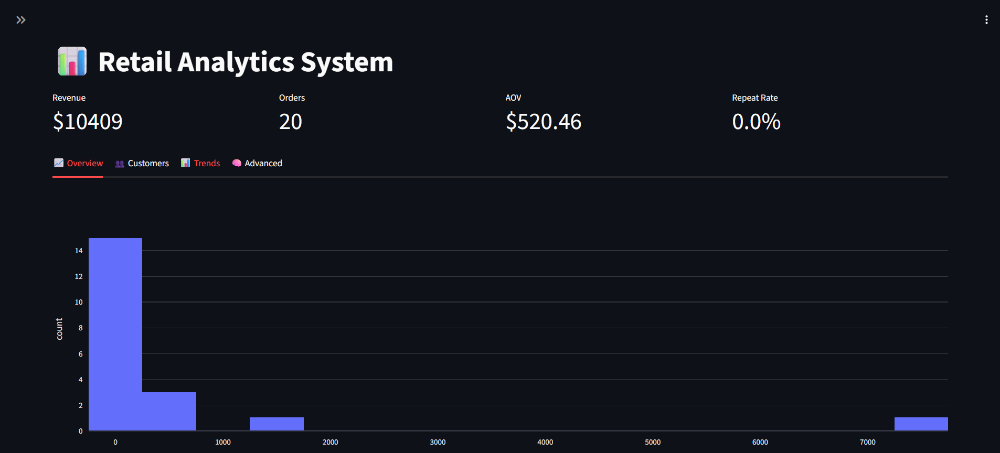
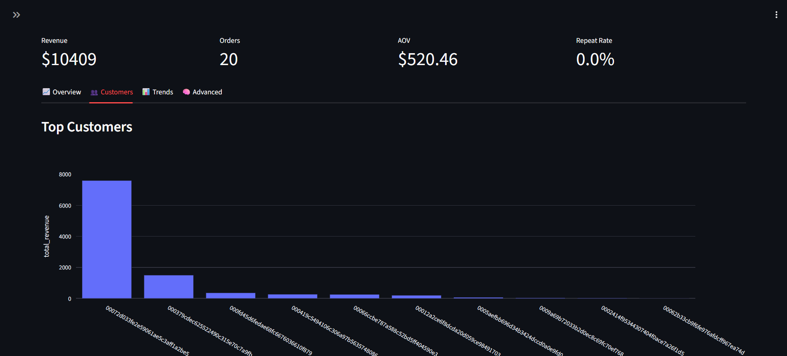
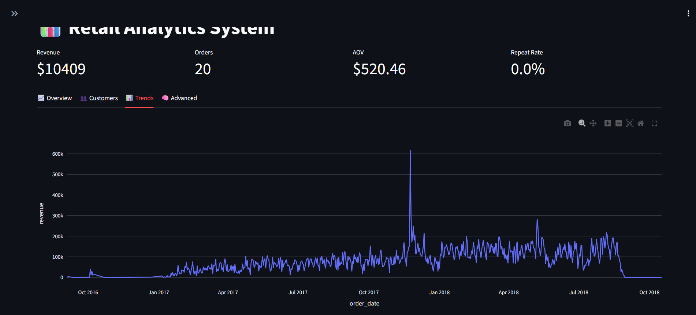

# 📊 Retail Analytics Dashboard (AWS Deployed)

## 🚀 Live Demo
http://34.203.36.162

---

## 📌 Overview

Built a production-style retail analytics platform using Airflow, PostgreSQL, Streamlit, and AWS EC2.

The system processes transactional data, stores it in PostgreSQL, and provides interactive business insights through a cloud-deployed dashboard.

---

## 🏗️ Architecture

Airflow → ETL → PostgreSQL → Streamlit → Nginx → AWS EC2

---

## 🛠️ Tech Stack

- Python
- Apache Airflow
- PostgreSQL
- Streamlit
- Plotly
- AWS EC2
- Nginx

---

## Dataset

A sample dataset is included after processing for demonstration purposes and raw datasets are also uploaded.

---

## 📊 Features

- KPI Dashboard
- Revenue Trend Analysis
- Customer Segmentation (RFM)
- Drill-down Analytics
- SQL-based Aggregations
- Cloud Deployment

---

## ⚡ Key Optimizations

- Reduced memory usage by shifting heavy computations from Pandas to SQL
- Implemented chunk-based loading for large datasets
- Configured persistent Streamlit service using systemd
- Deployed production-ready reverse proxy using Nginx

---

## 📸 Screenshots

### Dashboard Overview


### Customer Analytics


### Revenue Trends


### RFM Analytics


---

## ▶️ Run Locally

```bash
pip install -r requirements.txt
streamlit run dashboard/app.py